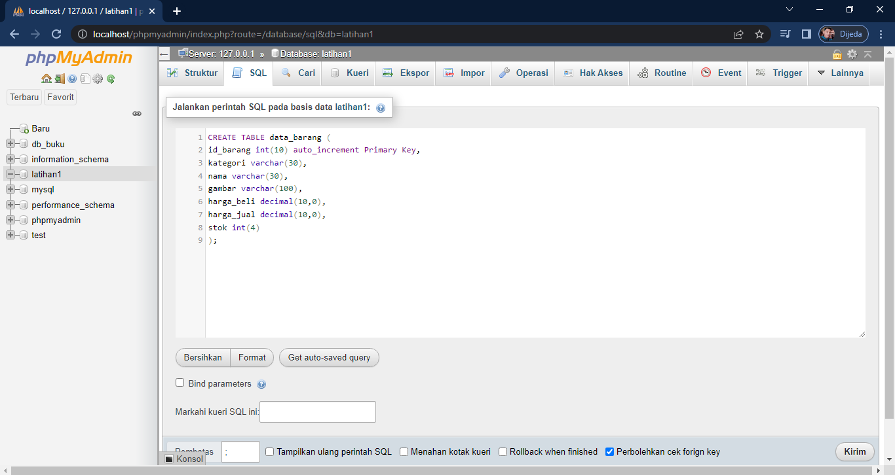
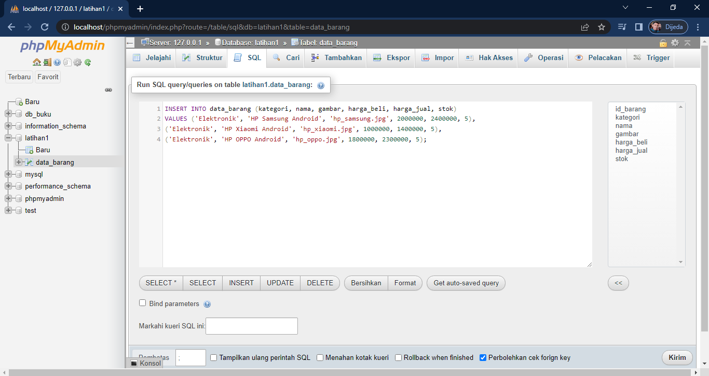
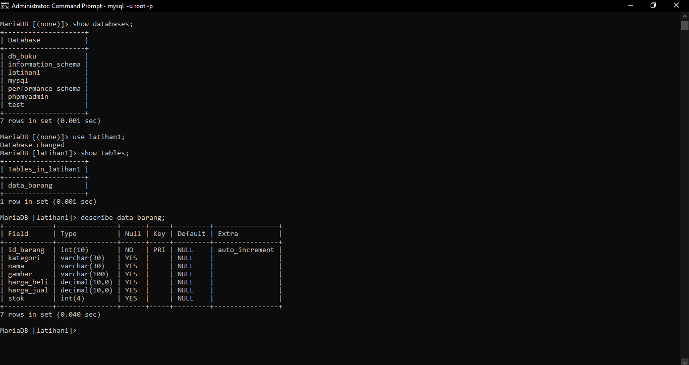
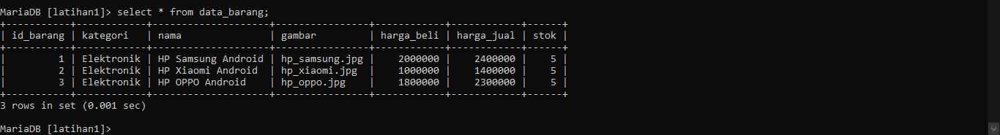
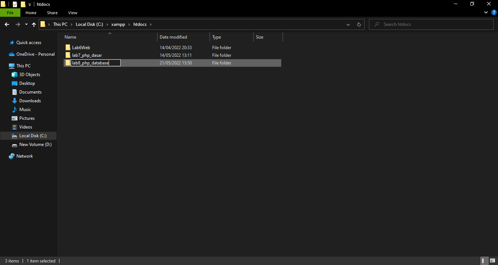
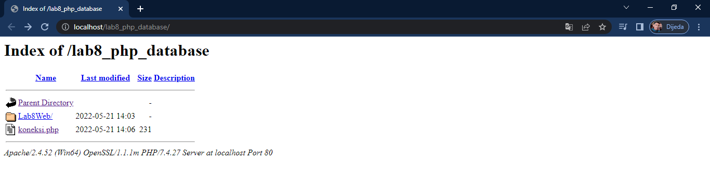
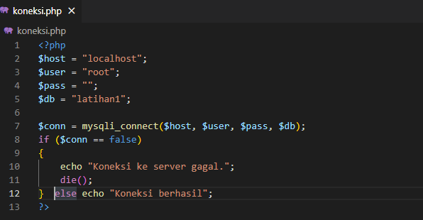
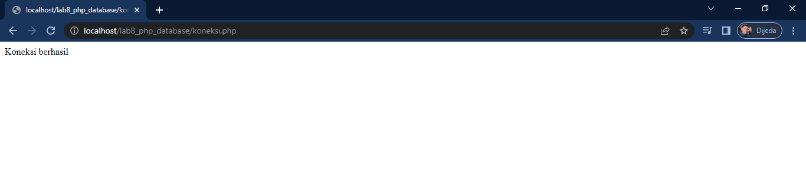

# Lab8Web
PHP dan Database MySQL
### Langkah-langkah Praktikum
### Persiapan
*Untuk memulai membuat aplikasi CRUD sederhana, yang perlu disiapkan adalah database server menggunakan MySQL. Pastikan MySQL Server sudah dapat dijalankan melalui XAMPP.*

### Mengakses MySQL Client menggunakan PHP MyAdmin
*Pastikan webserver Apache dan MySQL server sudah dijalankan. Kemudian buka melalui browser:* #http://localhost/phpmyadmin/

### Membuat Database
CREATE DATABASE latihan1;

### Memnbuat Tabel

### Menambahkan Data
Menambahkan data melalui phpMyAdmin

### Dan ini melihat database melalui Terminal/CMD

Tampilan Data Barang

### Membuat Program CRUD
Buat folder lab8_php_database pada root directory web server (d:\xampp\htdocs)

Kemudian untuk mengakses direktory tersebut pada web server dengan mengakses URL:
http://localhost/lab8_php_database/

### Membuat file koneksi database
Buat file baru dengan nama koneksi.php

Buka melalui browser untuk menguji koneksi database (untuk menyampilkan pesan
koneksi berhasil, uncomment pada perintah echo “koneksi berhasil”;

